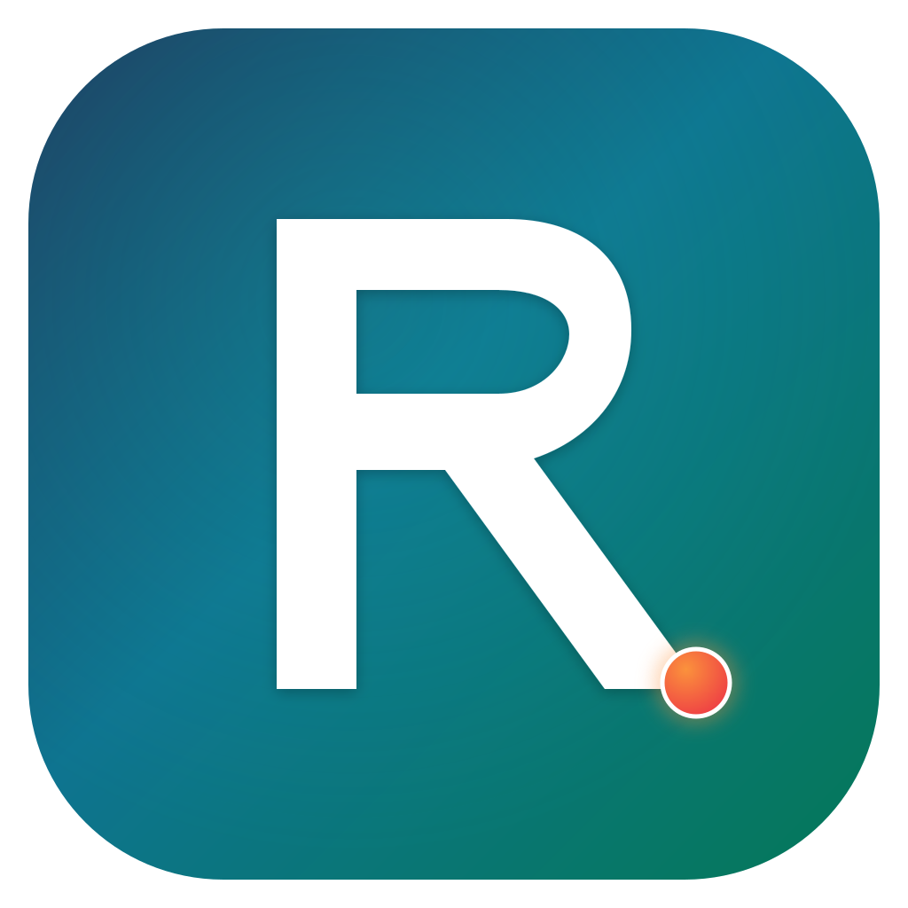
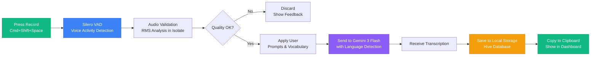
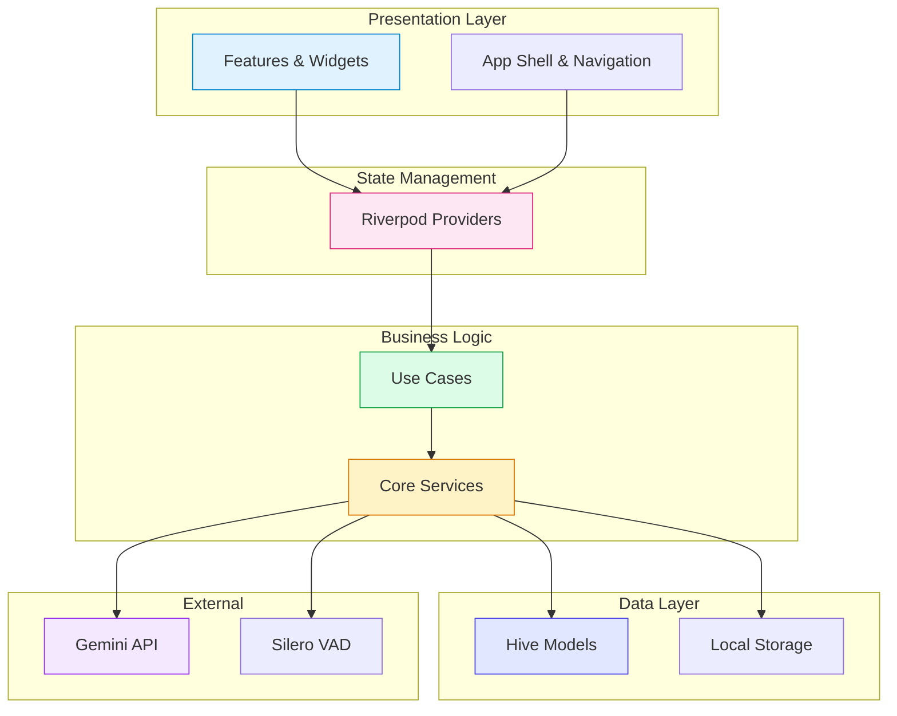
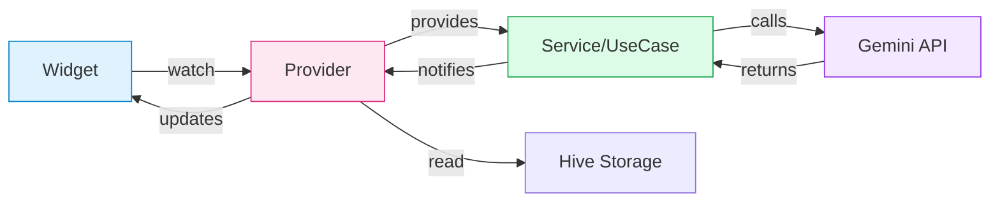

<div align="center">

  

  # Recogniz.ing

  ### **Voice, transformed.**

  *AI-powered voice typing that adapts to your workflow—privacy-first, cross-platform, and powered by Google Gemini 3 Flash*

  [](https://opensource.org/licenses/MIT)
  [](https://flutter.dev)
  [](https://github.com/xicv/recogniz.ing)

  [Website](https://recogniz.ing) • [Documentation](#-quick-start) • [Changelog](CHANGELOG.md) • [Report Issue](https://github.com/xicv/recogniz.ing/issues)

</div>

---

## ✨ What is Recogniz.ing?

Recogniz.ing turns your voice into text—intelligently. Whether you're writing emails, meeting notes, or the next great novel, it captures your words with remarkable accuracy.

**What makes it different:**

- **Privacy-first** — Your voice and transcriptions stay on your device
- **Free tier friendly** — Gemini 3 Flash's generous free tier covers daily use for most people
- **Multi-language** — Works in 20+ languages with automatic detection
- **Cross-platform** — macOS, Windows, Linux, iOS, Android, Web

---

##  Quick Start

### Prerequisites

You'll need two things:

1. **Flutter SDK** (3.38+)
   ```bash
   flutter doctor
   ```

2. **Gemini API Key** — [Get your free key from Google AI Studio](https://aistudio.google.com/app/apikey)
   - The free tier is generous: most users won't need to pay
   - If you do exceed it, paid tier is ~$0.075 per million characters

### Install & Run

```bash
# Clone the repository
git clone https://github.com/xicv/recogniz.ing.git
cd recogniz.ing

# Install dependencies
flutter pub get

# Run on your platform
flutter run -d macos      # macOS (recommended)
flutter run -d ios        # iOS Simulator
flutter run -d android    # Android device/emulator
flutter run -d windows    # Windows
flutter run -d linux      # Linux
flutter run -d web        # Web browser (limited features)
```

### Using the Makefile

The project includes a Makefile with 40+ commands for common tasks:

```bash
make get              # Install Flutter dependencies
make run-macos        # Run on macOS
make dev              # get + analyze + format + test
make quick-run        # get + run-macos (fastest start)
```

---

##  First Time Setup

Getting started takes about 2 minutes:

| Step | Action |
|:----:|--------|
| 1 | Launch Recogniz.ing |
| 2 | Go to **Settings** (press Cmd/Ctrl+5) |
| 3 | Enter your **Gemini API Key** (add multiple keys for automatic failover!) |
| 4 | (Optional) Customize prompts and vocabulary |
| 5 | Go back to **Dashboard** to see your free tier quota |
| 6 | Tap the **microphone button** or press `Cmd+Shift+Space` |
| 7 | Speak, then tap again to stop and transcribe |

---

##  Features at a Glance

###  Smart Voice Recording

| Feature | Description |
|---------|-------------|
| **Silero VAD** | ML-based voice activity detection (~95% accuracy) |
| **Graceful Fallback** | Amplitude-based VAD (~75%) when ML unavailable |
| **Global Hotkey** | `Cmd+Shift+Space` / `Ctrl+Shift+Space` anywhere on your system |
| **Smart Audio Format** | Auto-selects format based on recording duration |
| **Background Processing** | Smooth UI even during intensive audio analysis |

###  AI-Powered Transcription

Powered by **Google Gemini 3 Flash**—Google's fastest AI model:

- **Token-efficient prompts** — 67% less overhead
- **Auto-retry** — Handles transient API errors automatically
- **Multi-language** — 20+ languages with auto-detection
- **Code-switching** — Preserves mixed-language speech naturally
- **Long-form support** — Up to ~3.5 hours per request

###  Your Words, Your Way

| Customization | Options |
|---------------|---------|
| **Prompts** | 6 built-in (Clean, Formal, Bullets, Email, Meeting Notes, Social Media) + custom |
| **Vocabulary** | 6 sets (General, Technology, Business, Medical, Legal, Finance) + custom |
| **Language** | Auto-detect or choose from 20+ languages |
| **Audio Quality** | Auto (smart), Compact (AAC), or Full (PCM) |

###  Dashboard & Analytics

- **Free tier quota tracking** — Visual progress indicator
- **Multi-API key management** — Automatic failover when hitting rate limits
- **Usage projections** — See days until quota exhaustion
- **Per-key statistics** — Track usage across multiple API keys
- **Editable transcriptions** — Fix mistakes, save changes
- **Favorites** — Star important transcriptions for quick access

###  Privacy First

| What We Promise | Details |
|:----------------|:--------|
| **Local storage** | All data stays on your device |
| **No account required** | Use immediately after setup |
| **No telemetry** | We don't collect or send user data |
| **API only** | Audio sent only to Google for transcription, not stored |
| **Open source** | Code is transparent and auditable |

###  Modern UI/UX

- Material Design 3 with dynamic theming
- Collapsible left drawer navigation
- Light/Dark theme with system detection
- WCAG AAA compliant (7:1 contrast ratio)
- Keyboard shortcuts for power users

---

##  How It Works

### Transcription Flow



### Architecture Overview



### State Management Flow



---

##  Project Structure

The project follows **Clean Architecture** principles:

```
lib/
├── core/                    # Business logic and infrastructure
│   ├── constants/          # App-wide constants and UI dimensions
│   ├── config/             # Type-safe configuration classes
│   ├── error/              # Enhanced error handling system
│   ├── interfaces/         # Service interfaces (VadServiceInterface, etc.)
│   ├── models/             # Data models with Hive serialization
│   ├── providers/          # Riverpod state providers
│   ├── services/           # External integrations (Gemini, VAD, Audio...)
│   ├── theme/              # Material Design 3 theming
│   ├── use_cases/          # Business use cases
│   └── utils/              # Helper utilities
│
├── features/               # Feature-based organization
│   ├── app_shell.dart      # Main app container with navigation
│   ├── dashboard/          # Statistics and transcription history
│   ├── dictionaries/       # Vocabulary management
│   ├── prompts/            # AI prompt templates
│   ├── recording/          # Voice recording UI with VAD
│   ├── settings/           # Settings management
│   └── transcriptions/     # Transcription cards and display
│
└── widgets/                # Reusable UI components
    ├── navigation/         # Navigation drawer
    └── shared/             # Cross-feature components
```

> **Note**: The Flutter project root IS the repository root. Run all Flutter commands from `/recogniz.ing/`, not from a subdirectory.

---

##  Keyboard Shortcuts

| Shortcut | Action |
|----------|--------|
| `Cmd+Shift+Space` (macOS) / `Ctrl+Shift+Space` (Win/Lin) | Start/Stop recording |
| `Cmd/Ctrl+S` | Save edited transcription |
| `Cmd/Ctrl+1` | Go to Transcriptions |
| `Cmd/Ctrl+2` | Go to Dashboard |
| `Cmd/Ctrl+3` | Go to Dictionaries |
| `Cmd/Ctrl+4` | Go to Prompts |
| `Cmd/Ctrl+5` | Go to Settings |

---

##  Development

### Code Quality

```bash
make analyze          # flutter analyze
make format           # flutter format .
make test             # Run all tests
make test-coverage    # Run tests with coverage
make test-single TEST=test/widget_test.dart  # Run specific test
```

### Code Generation

```bash
make generate         # build_runner with delete-conflicting-outputs
# Run after modifying any model files with @HiveType annotations
```

### Version Management

```bash
make version          # Show current version
make sync-version     # Sync pubspec.yaml from CHANGELOG.json (SSOT)
make changelog        # Generate CHANGELOG.md from CHANGELOG.json
make verify-changelog # Verify changelogs are in sync
make bump-patch       # Bump patch version (1.0.0 → 1.0.1)
make bump-minor       # Bump minor version (1.0.0 → 1.1.0)
make bump-major       # Bump major version (1.0.0 → 2.0.0)
make release          # Bump patch + deploy all platforms
```

---

##  Landing Page

The repository includes a Vue 3 + Vite + TailwindCSS landing page that deploys to **[recogniz.ing](https://recogniz.ing/)**.

### Deployment Architecture

```
xicv/recogniz.ing (Single Repository)
├── .github/workflows/
│   ├── release-all-platforms.yml  # Builds app, creates releases
│   ├── build-windows.yml          # Windows-specific builds
│   └── landing-deploy.yml         # Deploys to GitHub Pages
└── landing/                        # Vue 3 landing page
    ├── src/
    ├── public/downloads/
    │   └── manifest.json           # Version manifest
    ├── public/.nojekyll            # Required for GitHub Pages + Vite
    └── package.json
```

**Tech Stack**: Vue 3.5, Vite 6.0, TailwindCSS 3.4, TypeScript 5.5, PWA

### Automated Release Flow

1. **Tag Push** → Push version tag (`v1.15.1`)
2. **Parallel Builds** → GitHub Actions builds all platforms
3. **GitHub Release** → Creates release with artifacts
4. **Update Manifest** → Updates download manifest
5. **Deploy Landing** → Triggers landing page deployment

### Landing Page Development

```bash
cd landing
npm install
npm run dev     # Start dev server
npm run build   # Build for production
```

---

##  Changelog

This project uses a **JSON-first changelog system** where `CHANGELOG.json` is the source of truth and `CHANGELOG.md` is auto-generated.

### Why JSON?

| Benefit | Explanation |
|---------|-------------|
| **Programmatic Access** | Easy to parse and render in UI components |
| **Validation** | Schema can be validated, reducing errors |
| **Automation** | CI/CD can easily read and process data |
| **Single Source** | Edit one file, generate the other |

### Workflow

```bash
# 1. Bump version with entry template
make bump-patch-entry

# 2. Edit CHANGELOG.json with actual changes

# 3. Generate Markdown from JSON
make changelog

# 4. Commit both files together
git add CHANGELOG.json CHANGELOG.md pubspec.yaml
git commit -m "chore: bump version to X.Y.Z and update changelog"
```

For detailed version history, see [CHANGELOG.md](CHANGELOG.md).

---

##  Troubleshooting

| Problem | Solution |
|---------|----------|
| **"Microphone permission denied"** | • macOS: System Preferences → Security & Privacy → Privacy → Microphone<br>• iOS: Settings → Recogniz.ing → Microphone<br>• Android: Settings → Apps → Recogniz.ing → Permissions |
| **"API key invalid"** | • Ensure you copied the full API key from Google AI Studio<br>• Check that your API key has Gemini API access enabled<br>• Verify network connectivity |
| **"Global hotkey not working"** | • Ensure app has accessibility permissions (macOS)<br>• Check for conflicting hotkeys in system settings |
| **"Transcription is empty"** | • Ensure audio was captured (check recording duration)<br>• Verify vocabulary doesn't interfere with common words<br>• Check network connection to Gemini API |

---

##  License

[MIT License](LICENSE)

---

<div align="center">

  **Made with  by [@xicv](https://github.com/xicv)**

  [Website](https://recogniz.ing) • [GitHub](https://github.com/xicv/recogniz.ing) • [Report Issue](https://github.com/xicv/recogniz.ing/issues)

</div>
